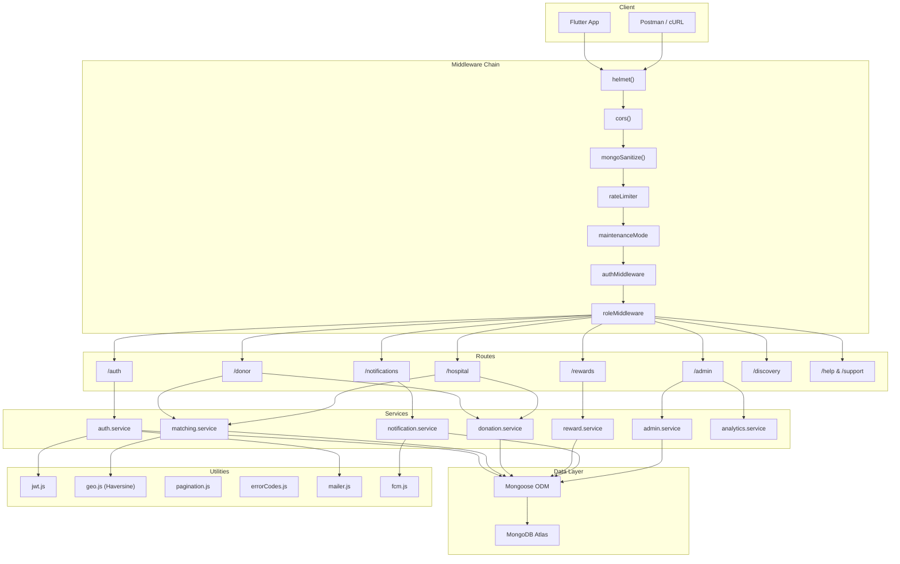

# LifeLink Backend API

LifeLink is a Node.js + Express backend for donor-hospital donation workflows. This repository is the verified stabilization branch prepared for Flutter client integration.

## Architecture



### Layered MVC+S Pattern

| Layer | Responsibility | Example |
|-------|---------------|---------|
| **Route** | HTTP verb mapping, Swagger docs | `auth.routes.js` |
| **Middleware** | Auth, rate-limiting, validation, maintenance bypass | `auth.middleware.js` |
| **Controller** | Request normalization, error-to-HTTP mapping | `auth.controller.js` |
| **Service** | Business logic, transactions, DB queries | `auth.service.js` |
| **Model** | Schema, indexes, discriminators, statics | `User.model.js` |
| **Utility** | Cross-cutting: JWT, geo, pagination, error codes | `jwt.js`, `geo.js` |

### Key Design Decisions

- **Mongoose Discriminators** — `Donor` and `Hospital` share the `users` collection via discriminator inheritance, enabling polymorphic queries.
- **Haversine Geo-Matching** — Real distance-based scoring between donors and hospitals using the `geo.js` utility. Nearby donors rank higher.
- **Atomic Gamification** — Points awards use `mongoose.startSession()` with `withTransaction()` for ACID guarantees. Deduplication via partial unique indexes prevents double-awards.
- **Dual JWT Tokens** — Short-lived access tokens + long-lived refresh tokens with blacklist support.
- **Maintenance Bypass** — Admin requests bypass maintenance mode; the check is cached in-memory (30s TTL) to avoid per-request DB hits.

## Quick Start

1. **Install dependencies**:
   ```bash
   npm install
   ```
2. **Environment Configuration**:
   Copy the example environment file and fill in required values (e.g. MongoDB URI).
   ```bash
   cp .env.example .env
   ```
3. **Start the Development Server**:
   ```bash
   npm start
   ```
4. **Verify Runtime**:
   Ensure the API is active by checking the health endpoint:
   ```bash
   curl http://127.0.0.1:5000/health
   ```
5. **View API Documentation**:
   Open your browser to:
   `http://127.0.0.1:5000/api-docs`

## Key Scripts

| Command | Purpose |
|---|---|
| `npm start` | Start backend with runtime checks |
| `npm run dev` | Start backend in watch mode |
| `npm test` | Run automated test suite (76 tests) |
| `npm run test:watch` | Run tests in watch mode for TDD |
| `npm run seed` | Seed local database with verified test accounts |
| `npm run test:auth-flow` | Run E2E authentication smoke tests |
| `npm run generate:openapi` | Update the `openapi.json` artifact from YAML |

## Test Suite

The project includes **76 automated tests** across 6 test files using [Vitest](https://vitest.dev/) with MongoDB Memory Server:

| Test File | Tests | Coverage |
|-----------|-------|----------|
| `geo.test.js` | 14 | Haversine distance, location scoring, proximity |
| `matching.service.test.js` | 14 | Blood type compatibility, geo-scoring, N+1 elimination |
| `reward.service.test.js` | 13 | Tier calculation, atomic transactions, idempotency |
| `auth.validation.test.js` | 18 | Login/register validation, role-specific rules |
| `pagination.test.js` | 11 | Page/skip parsing, limit clamping, meta calculation |
| `jwt.test.js` | 6 | Token signing, verification, expiry, tamper detection |

```bash
npm test
```

## Test Accounts

For Flutter development, bypass SMTP verification by seeding the database with pre-verified accounts:

```bash
npm run seed
```

> [!WARNING]
> The seed script is strictly for **development environments only**. Built-in safeguards will actively prevent this script from executing against `NODE_ENV=production` or Atlas production clusters.

This generates:
- **Donor**: `donor@test.com` / `SecurePass@123`
- **Hospital**: `hospital@test.com` / `SecurePass@123`

## Technical Documentation

Detailed architectural notes, request collections, and OpenAPI files are located in the [`/docs`](docs/README.md) directory.

- **[docs/README.md](docs/README.md)**: Architecture, Auth Flows, and Testing details.
- **[docs/LifeLink-Auth-API.postman_collection.json](docs/LifeLink-Auth-API.postman_collection.json)**: Importable Postman workspace.
- **[openapi.yaml](openapi.yaml)**: OpenAPI / Swagger source of truth.
