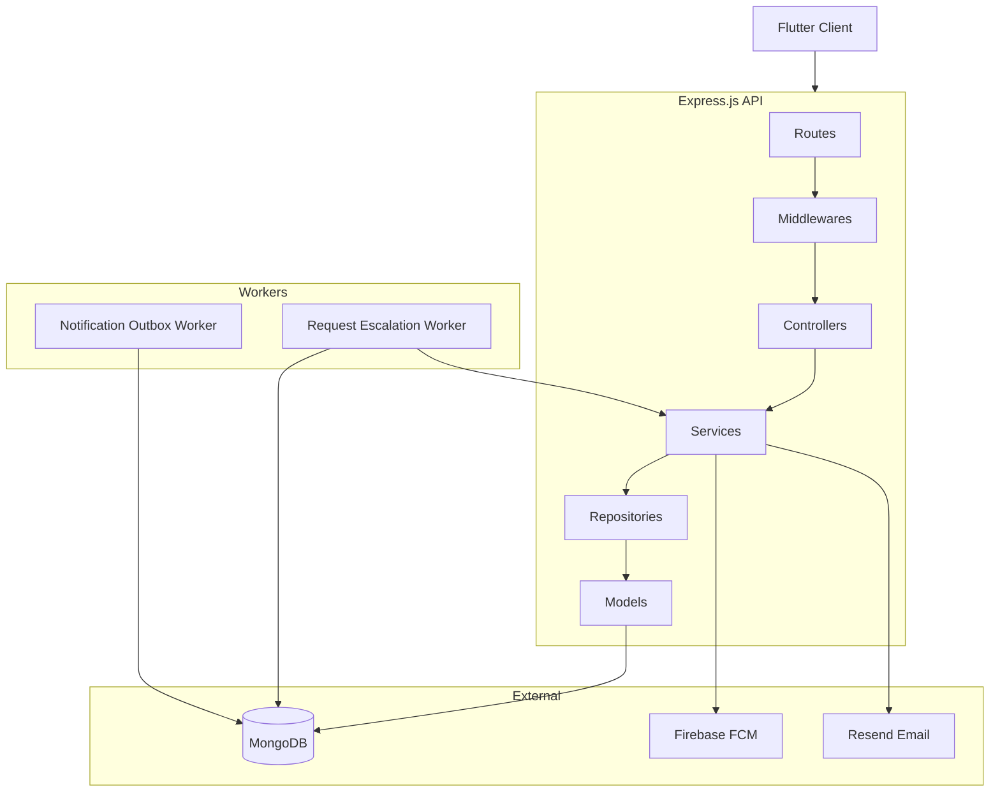
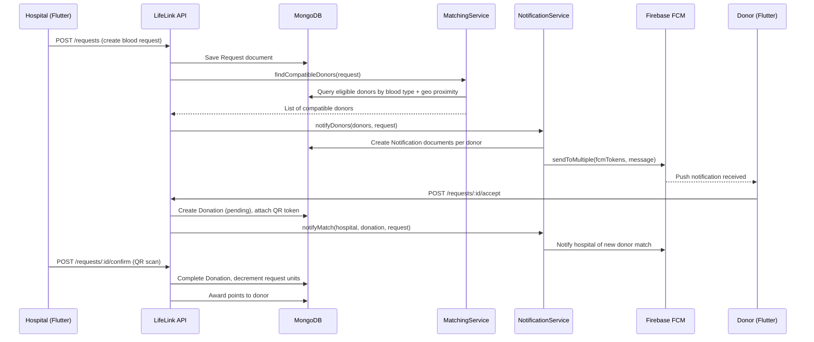
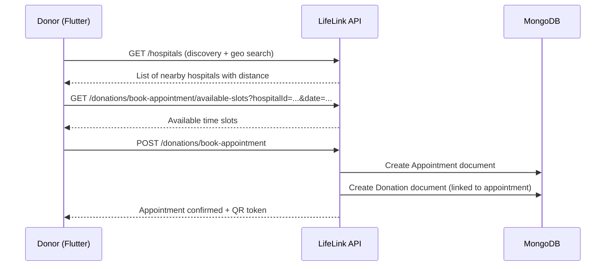
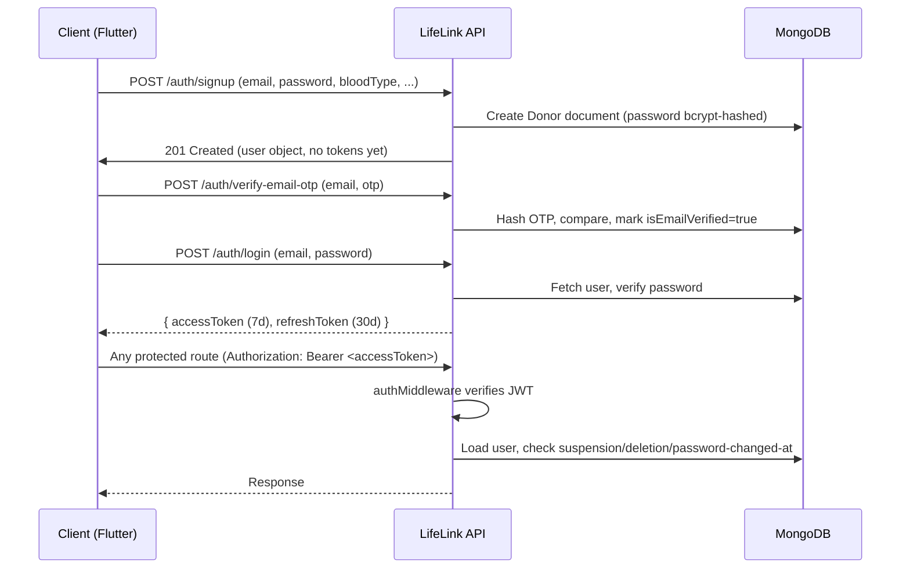

# LifeLink — System Architecture

> **Document Type:** Software Documentation  
> **Version:** 1.0  
> **Generated From:** Codebase Analysis — June 2026  

---

## 1. High-Level Architecture

LifeLink follows a classic **three-tier REST API architecture**:

```
┌─────────────────────────────────────────────────────┐
│                Flutter App (iOS/Android)             │
│               HTTP/HTTPS REST Requests               │
└──────────────────────────┬──────────────────────────┘
                           │
┌──────────────────────────▼──────────────────────────┐
│              LifeLink REST API (Express.js 5.x)      │
│                      Node.js 20+                     │
│  ┌──────────────┐  ┌────────────┐  ┌─────────────┐  │
│  │  Auth/Security│  │Core Routes │  │Admin Routes │  │
│  └──────────────┘  └────────────┘  └─────────────┘  │
│  ┌───────────────────────────────────────────────┐   │
│  │  Background Workers (in-process setInterval)  │   │
│  │  - Notification Outbox Worker (5s interval)   │   │
│  │  - Request Escalation Worker (60s interval)   │   │
│  └───────────────────────────────────────────────┘   │
└──────────────────────────┬──────────────────────────┘
                           │
          ┌────────────────┼────────────────┐
          │                │                │
┌─────────▼────┐  ┌────────▼──────┐  ┌─────▼──────┐
│   MongoDB     │  │  Firebase FCM  │  │   Resend   │
│  (Mongoose)   │  │  (Push Notifs) │  │   Email    │
└──────────────┘  └───────────────┘  └────────────┘
```

**Source:** `src/app.js`, `src/server.js`, `src/config/db.js`, `package.json`

---

## 2. Internal Layer Architecture

The codebase enforces a strict unidirectional dependency flow:

```
HTTP Request
    │
    ▼
Routes (src/routes/*.routes.js)
    │  — mount, apply middleware chain
    ▼
Middlewares (auth, role, rateLimit, maintenance)
    │
    ▼
Controllers (src/controllers/*.controller.js)
    │  — parse request, map HTTP shape
    ▼
Services (src/services/*.service.js)
    │  — business logic, throw HttpError
    ▼
Repositories (src/repositories/*.js)
    │  — data access, wraps Mongoose
    ▼
Models (src/models/*.model.js)
    │  — Mongoose schema + hooks
    ▼
MongoDB
```

**Source:** `AGENTS.md` — Section 2 "Project structure"

> **Hard rule (from `AGENTS.md`):** A service may not import a controller. A model may not import a service. A utility may not import a controller, service, or model.

---

## 3. Component Responsibilities

### 3.1 Routes (`src/routes/`)

| File | Mount Path | Responsibility |
|------|-----------|----------------|
| `auth.routes.js` | `/auth` | Registration, login, OTP, FCM tokens |
| `donor.routes.js` | `/donor` | Donor profile, matches, health history |
| `hospital.routes.js` | `/hospital` | Hospital profile, settings, blood inventory |
| `admin.routes.js` | `/admin` | Full system management |
| `request.routes.js` | `/requests` | Blood request lifecycle |
| `donation.routes.js` | `/donations` | Donation completion |
| `appointment.routes.js` | `/donations/book-appointment` | Appointment booking |
| `appointmentVerify.routes.js` | `/appointments` | QR-based appointment verification |
| `reward.routes.js` | `/rewards` | Points, badges, redemptions |
| `notification.routes.js` | `/notifications` | In-app notification inbox |
| `analytics.routes.js` | `/analytics` | Statistics and leaderboard |
| `discovery.routes.js` | `/hospitals` | Hospital search and discovery |
| `activity.routes.js` | `/donor` | Activity timeline (mounted on `/donor`) |
| `help.routes.js` | `/help` | Help documents and FAQs |
| `support.routes.js` | `/support` | Support message submission |
| `webhook.routes.js` | `/api/webhooks` | External webhook receiver (stub) |

**Source:** `src/app.js` lines 135–189

> **Note:** Routes are mounted at root level. There is no global `/api` prefix in production route paths (the `/api/webhooks` path is the only exception). Source: `AGENTS.md` Section 2.

### 3.2 Middlewares (`src/middlewares/`)

| File | Purpose |
|------|---------|
| `auth.middleware.js` | Verifies Bearer JWT; blocks deleted, suspended, and unverified accounts; attaches `req.user` |
| `role.middleware.js` | Role-based access control; enforces the `role` field from the JWT payload |
| `rateLimit.middleware.js` | Two limiters: `authLimiter` (strict) for auth routes, `limiter` (general) for all other routes |
| `maintenance.middleware.js` | Blocks all non-admin routes when maintenance mode is enabled in system settings |
| `error.middleware.js` | Central error handler; maps `HttpError` status codes to JSON responses |
| `i18n.middleware.js` | Exposes `req.t()` and `req.lang` from `Accept-Language` header |
| `asyncHandler.js` | Wraps async route handlers; forwards thrown errors to `next()` |
| `donor-rate-limit.middleware.js` | Donor-specific rate limiter for high-volume donor routes |

**Source:** `src/middlewares/` directory listing, `src/app.js`

### 3.3 Services (`src/services/`)

| File | Responsibility |
|------|---------------|
| `auth.service.js` | Registration, login, token management, OTP flows |
| `matching.service.js` | Blood-type compatibility + geo-proximity donor-to-request matching |
| `eligibility.service.js` | Medical eligibility rule evaluation for donors |
| `notification.service.js` | In-app notification creation + FCM push delivery |
| `reward.service.js` | Points calculation, tier management, badge awarding, redemption |
| `appointment.service.js` | Appointment booking, slot availability, rescheduling |
| `donation.service.js` | Donation record management |
| `donation-completion.service.js` | Atomic donation completion with points and state transitions |
| `request.service.js` | Blood request CRUD and lifecycle helpers |
| `request-lifecycle.service.js` | Complex request state transitions (accept, confirm, close) |
| `admin.service.js` | System settings, user management, analytics aggregation |
| `analytics.service.js` | Aggregation queries for statistics and leaderboard |
| `activity.service.js` | Activity timeline event creation |
| `eventBus.service.js` | In-process pub/sub for decoupled service communication |
| `audit.service.js` | Admin audit log creation |
| `rewardsConfig.service.js` | Reward configuration management |

**Source:** `src/services/` directory listing

### 3.4 Models (`src/models/`)

See `03_Database_Design.md` for the full entity description.

### 3.5 Workers (`src/workers/`)

| File | Interval | Responsibility |
|------|----------|---------------|
| `notificationOutbox.worker.js` | 5 seconds (default) | Processes pending outbox entries for deferred notification delivery |
| `requestEscalation.worker.js` | 60 seconds (default) | Expires donations past arrival deadlines; re-broadcasts unfulfilled requests |

Workers run in-process using `setInterval`. They are started in `src/server.js` and stopped gracefully on `SIGINT`/`SIGTERM`.

**Source:** `src/server.js` lines 38–76

---

## 4. Module Relationships



---

## 5. Data Flow — Blood Request to Donor Notification



---

## 6. Data Flow — Appointment Booking



---

## 7. Authentication Data Flow



---

## 8. External Integrations

| Service | Purpose | How Configured |
|---------|---------|----------------|
| **MongoDB** | Primary database | `MONGO_URI` env var; Mongoose with connection pool (max 10, min 2) |
| **Firebase Admin SDK (FCM)** | Push notifications to donor and hospital devices | `FIREBASE_PROJECT_ID`, `FIREBASE_CLIENT_EMAIL`, `FIREBASE_PRIVATE_KEY` env vars, or `FIREBASE_SERVICE_ACCOUNT_PATH` |
| **Resend** | Transactional email delivery (OTP, password reset, verification) | `RESEND_API_KEY` env var |
| **Nodemailer** | Listed as dependency; precise usage relative to Resend not fully traced | `package.json` |

**Source:** `package.json`, `.env.example`, `src/config/db.js`

---

## 9. Security Middleware Chain

When a request arrives at any protected route:

```
Request
  → helmet() [security headers]
  → cors() [CORS enforcement]
  → requestLogger [Morgan-based logging]
  → express.json() [body parsing, 1MB limit]
  → i18nMiddleware [locale detection]
  → NoSQL sanitizer [strip $ and . from keys]
  → maintenanceMiddleware [block if system in maintenance]
  → authMiddleware [JWT verification, account status checks]
  → requireRole() [role enforcement]
  → rateLimit [in-memory sliding window]
  → Controller handler
  → errorMiddleware [global error handler]
```

**Source:** `src/app.js` lines 38–213

---

## Confidence Report

**Verified Facts:**
- Layer diagram is derived from `AGENTS.md` Section 2 explicit rules.
- Route mount paths come directly from `src/app.js`.
- Middleware chain order comes from `src/app.js` middleware registration order.
- Worker intervals come from `src/server.js` `startOutboxWorker` and `startEscalationWorker` default values.
- External services come from `package.json` dependencies and `.env.example`.

**Assumptions:** None.

**Missing Information:**
- Precise Nodemailer vs. Resend fallback logic was not fully read.
- Repository layer files (`src/repositories/`) were not individually inspected; listed as layer based on `AGENTS.md` structure documentation.

**Potential Uncertainty:**
- The `EventBus.service.js` (pub/sub) was identified but its specific event types and listener registrations were not fully traced in `eventListeners.registry.js`.
