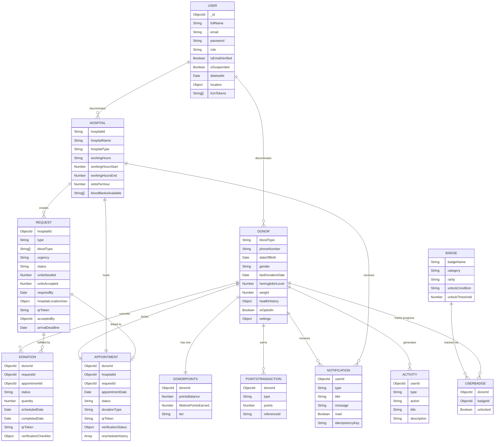

# LifeLink — Database Design

> **Document Type:** Software Documentation  
> **Version:** 1.0  
> **Generated From:** Codebase Analysis — June 2026  

---

## 1. Database Overview

- **Database Engine:** MongoDB (version 6.0+ required)
- **ODM:** Mongoose 9.x
- **Connection:** Single connection pool (`maxPoolSize: 10`, `minPoolSize: 2`) via `MONGO_URI` environment variable
- **Auto-indexing:** Disabled at startup (`autoIndex: false`); indexes are declared in schema definitions and must be created explicitly via migration or seed scripts
- **Transactions:** Supported (codebase uses `MongoMemoryReplSet` for tests; production requires a MongoDB replica set for multi-document transactions)

**Source:** `src/config/db.js`, `src/models/User.model.js`, `AGENTS.md` Section 7.2

---

## 2. Entity Overview

The database contains **25 Mongoose model files** defining the following primary entities:

| Collection (Model) | Description |
|--------------------|-------------|
| `users` (User) | Base document for all roles; Donor and Hospital are discriminators |
| `users` (Donor) | Donor-specific fields stored in the `users` collection via discriminator |
| `users` (Hospital) | Hospital-specific fields stored in the `users` collection via discriminator |
| `requests` (Request) | Hospital-created blood/plasma/platelet donation requests |
| `donations` (Donation) | Tracks each donor's commitment to fulfill a request |
| `appointments` (Appointment) | Scheduled donation appointments between a donor and hospital |
| `notifications` (Notification) | In-app notification inbox for donors and hospitals |
| `notificationoutboxes` (NotificationOutbox) | Deferred notification delivery queue |
| `activities` (Activity) | Append-only audit/timeline log of user actions |
| `donorpoints` (DonorPoints) | Points balance and tier per donor |
| `pointstransactions` (PointsTransaction) | Ledger of all points earned or redeemed |
| `badges` (Badge) | Catalog of achievable badges (seeded at startup) |
| `userbadges` (UserBadge) | Progress and unlock state per donor-badge pair |
| `rewardcatalogs` (RewardCatalog) | Catalog of redeemable reward items |
| `rewardredemptions` (RewardRedemption) | Records of donor reward redemptions |
| `rewardsconfigs` (RewardsConfig) | Configurable point values and tier thresholds |
| `refreshtokenblacklists` (RefreshTokenBlacklist) | Blacklisted JWT refresh tokens |
| `onetimeotps` (OneTimeOtp) | One-time passwords (password reset, etc.) |
| `auditlogs` (AuditLog) | Admin action audit trail |
| `systemsettings` (SystemSettings) | Global platform settings (maintenance mode, etc.) |
| `hospitalsettings` (HospitalSettings) | Per-hospital configuration |
| `supportmessages` (SupportMessage) | User-submitted support messages |
| `helpdocuments` (HelpDocument) | FAQ and help articles |
| `inboundemails` (InboundEmail) | Received inbound email records |
| `rolepermissions` (RolePermission) | Role-based permission definitions |

**Source:** `src/models/` directory (25 files)

---

## 3. Entity Relationships

---

## 4. Key Entity Descriptions

### 4.1 User / Donor / Hospital (Discriminator Pattern)

All three roles share a single `users` collection using the **Mongoose discriminator pattern**. The `role` field (`donor`, `hospital`, `admin`, `superadmin`) acts as the discriminator key.

- `User` contains all shared fields: `fullName`, `email`, `password` (bcrypt-hashed), `role`, `location`, `fcmTokens`, `isSuspended`, `deletedAt`.
- `Donor` extends `User` with blood donation-specific fields: `bloodType`, `dateOfBirth`, `hemoglobinLevel`, `lastDonationDate`, `travelHistory`, `healthHistory`, `isOptedIn`.
- `Hospital` extends `User` with facility fields: `hospitalId` (unique business key), `hospitalName`, `hospitalType`, `workingHours`, `slotsPerHour`, `bloodBanksAvailable`.

**Soft delete:** The `deletedAt` field implements soft deletion. A non-null `deletedAt` means the account is inactive; queries must filter by `{ deletedAt: null }`.

**Cascade on soft delete:** When a user is soft-deleted, a Mongoose post-hook cascades: donor deletions cancel pending donations and appointments; hospital deletions cancel pending requests and appointments. Source: `src/models/User.model.js` lines 236–363.

### 4.2 Request

Represents a hospital's need for blood, plasma, or platelets.

Key fields:
- `type`: enum `['blood', 'plasma', 'platelets', 'double_red_cells']`
- `urgency`: enum `['low', 'medium', 'high', 'critical']`
- `status`: enum `['pending', 'in-progress', 'completed', 'cancelled']`
- `bloodType`: array of compatible blood type strings (e.g., `['A+', 'O+']`)
- `unitsNeeded` / `unitsAccepted`: tracks multi-donor fulfillment
- `hospitalLocationGeo`: GeoJSON `Point` for geo-query support (2dsphere index)
- `qrToken`: unique QR code for donation verification handoff
- `arrivalDeadline`: computed deadline based on urgency
- `escalationLevel`: tracks re-broadcast attempts by the escalation worker

**Source:** `src/models/Request.model.js`

### 4.3 Donation

Represents a single donor's commitment to a specific request.

Key fields:
- `status`: enum `['pending', 'scheduled', 'completed', 'cancelled', 'rejected', 'expired', 'abandoned']`
- `appointmentScheduleDeadline`: donation auto-cancels 14 days after creation if no appointment is booked
- `qrToken` / `qrUsed` / `qrExpiresAt`: QR verification lifecycle
- `verificationChecklist`: `{ idVerified, questionnaireCompleted, consentSigned }`
- `arrivalDeadline`: urgency-based window for the donor to physically arrive

**Unique constraint:** Only one active (non-cancelled, non-rejected) donation per donor per request, enforced by a partial index: `{ donorId, requestId }` where `status = 'pending'`.

**Source:** `src/models/Donation.model.js`

### 4.4 Appointment

Represents a scheduled donation session.

Key fields:
- `donorDetails`: snapshot of donor info at booking time (for backward compatibility)
- `donationType`: enum from `donation.constants.js` (whole blood, plasma, platelets, etc.)
- `rescheduleHistory`: array of up to 10 reschedule events
- `verificationStatus`: `['pending', 'verified', 'rejected', 'completed']`
- `qrToken`: unique QR code for on-site check-in

**Unique constraint:** Only one active appointment per donor-hospital pair in `pending` or `confirmed` status, via partial index.

**Source:** `src/models/Appointment.model.js`

### 4.5 DonorPoints

One document per donor. Separated from the Donor document for atomic `$inc` operations.

| Tier | Minimum Lifetime Points |
|------|------------------------|
| bronze | 0 |
| silver | 1,000 |
| gold | 2,500 |
| platinum | 5,000 |

`lifetimePointsEarned` never decreases (used for tier). `pointsBalance` reflects spendable points (earned minus redeemed).

**Source:** `src/models/DonorPoints.model.js`

### 4.6 Notification

In-app notification documents.

- Auto-delete TTL: 90 days (`expireAfterSeconds: 90 * 24 * 60 * 60`)
- Deduplication: unique sparse index on `idempotencyKey`
- Types: `['match', 'request', 'milestone', 'emergency', 'system', 'admin', 'appointment']`

**Source:** `src/models/Notification.model.js`

### 4.7 Activity

Append-only event log. Display strings pre-rendered at write time.

- Auto-delete TTL: 365 days
- Deduplication: unique index on `{ userId, action, referenceId }` (partial, when `referenceId` is a string)

**Source:** `src/models/Activity.model.js`

### 4.8 Badge

Static catalog seeded at startup. Unlock conditions reference metric keys:
- `completedDonations`: count of completed donations
- `emergencyResponses`: count of emergency responses

Rarity levels: `COMMON`, `RARE`, `EPIC`, `LEGENDARY`

**Source:** `src/models/Badge.model.js`, `src/services/reward.service.js` (SEED_BADGES constant)

---

## 5. Critical Database Indexes

| Collection | Index | Purpose |
|-----------|-------|---------|
| `users` | `{ email: 1 }` unique | Login lookup |
| `users` | `{ role: 1 }` | Role-filtered queries |
| `users` | `{ deletedAt: 1 }` | Soft-delete filter |
| `users` | `{ fullNameNormalized: 1 }` | Name search |
| `users` (Hospital) | `{ hospitalId: 1 }` unique | Hospital business key |
| `users` (Donor) | `{ bloodType: 1 }` | Blood type matching |
| `requests` | `{ hospitalId, status }` | Hospital request listing |
| `requests` | `{ urgency, status }` | Urgency-filtered queries |
| `requests` | `{ hospitalLocationGeo: '2dsphere' }` | Geo proximity queries |
| `requests` | `{ arrivalDeadline: 1 }` | Escalation worker queries |
| `donations` | `{ donorId, status }` | Donor's active donations |
| `donations` | `{ requestId, status }` | Request fulfillment tracking |
| `donations` | `{ donorId, requestId }` partial unique (status=pending) | Prevent duplicate acceptances |
| `donations` | `{ appointmentId }` unique partial | One donation per appointment |
| `appointments` | `{ donorId, hospitalId, status }` unique partial (pending/confirmed) | Prevent duplicate bookings |
| `notifications` | `{ userId, createdAt: -1 }` | Notification inbox |
| `notifications` | `{ createdAt: 1 }` TTL (90 days) | Auto-cleanup |
| `activities` | `{ userId, createdAt: -1 }` | Timeline query |
| `activities` | `{ userId, action, referenceId }` unique partial | Deduplication |
| `activities` | `{ createdAt: 1 }` TTL (365 days) | Auto-cleanup |
| `donorpoints` | `{ lifetimePointsEarned: -1 }` | Leaderboard query |

**Source:** Schema index declarations across all model files

---

## Confidence Report

**Verified Facts:**
- All 25 model files are listed in `src/models/` directory.
- Entity fields, status enums, and index definitions come directly from the model source files.
- Tier thresholds come directly from `DonorPoints.model.js` static methods.
- TTL values come directly from the model index declarations.
- The discriminator pattern (Donor/Hospital extending User) is explicitly coded in `Donor.model.js` and `Hospital.model.js`.
- The cascade soft-delete hook is explicitly in `User.model.js` post-hook.

**Assumptions:** None.

**Missing Information:**
- Collection names are inferred from Mongoose conventions (lowercase plural of model name). They were not read from a database introspection tool.
- `PointsTransaction.model.js` and `RewardRedemption.model.js` fields are listed in Section 2 by name only; their detailed schemas were not fully read.

**Potential Uncertainty:**
- The `InboundEmail.model.js` and `HelpDocument.model.js` files were listed but not read in full; their purposes are inferred from their names.
