# LifeLink — User Flow & System Workflows

> **Document Type:** Software Documentation  
> **Version:** 1.0  
> **Generated From:** Codebase Analysis — June 2026  

---

## 1. User Roles and Entry Points

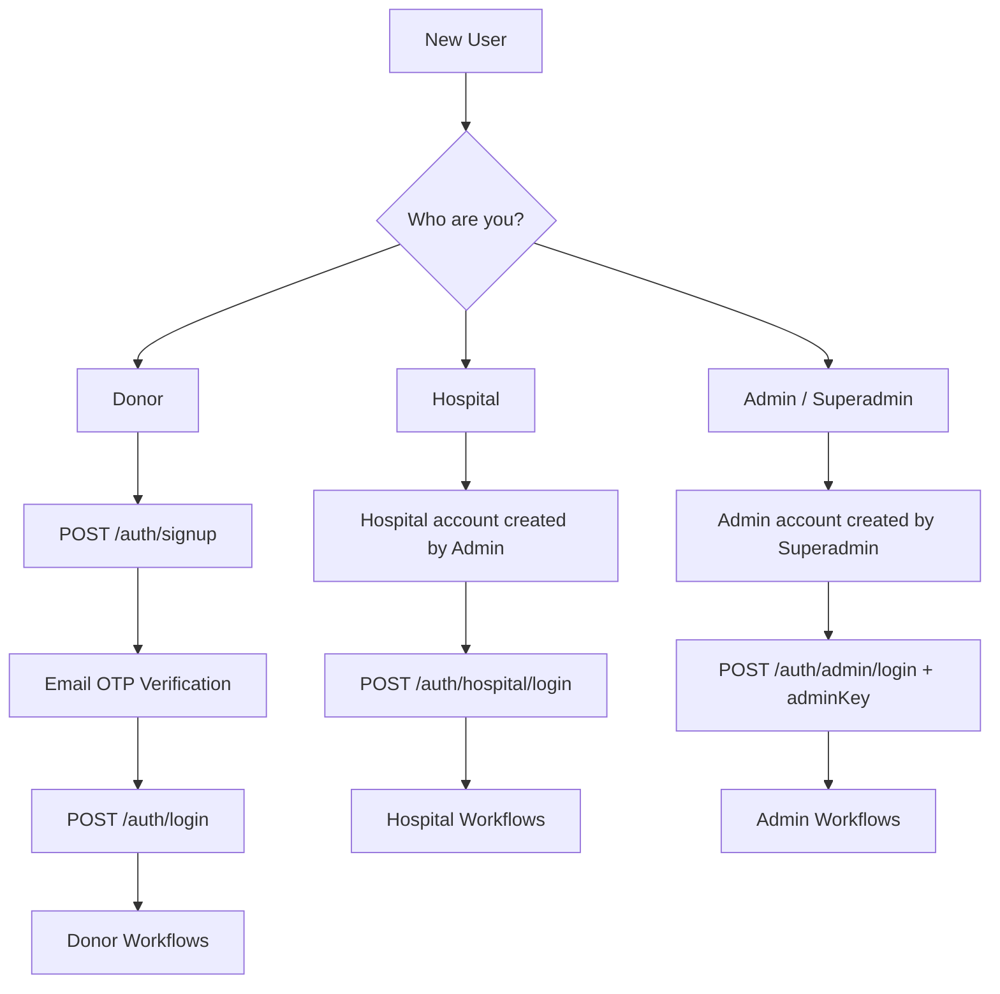

---

## 2. Donor Registration & Verification

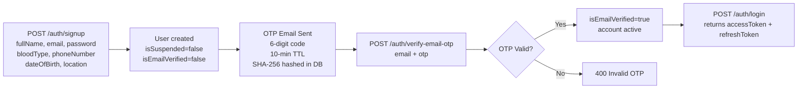

**Key rules:**
- Self-registration is available to donors only. Hospitals and admins are created by higher-authority users.
- Email must be verified before any protected route can be accessed (enforced in `auth.middleware.js`).

**Source:** `src/services/auth.service.js`, `src/middlewares/auth.middleware.js`

---

## 3. Token Lifecycle

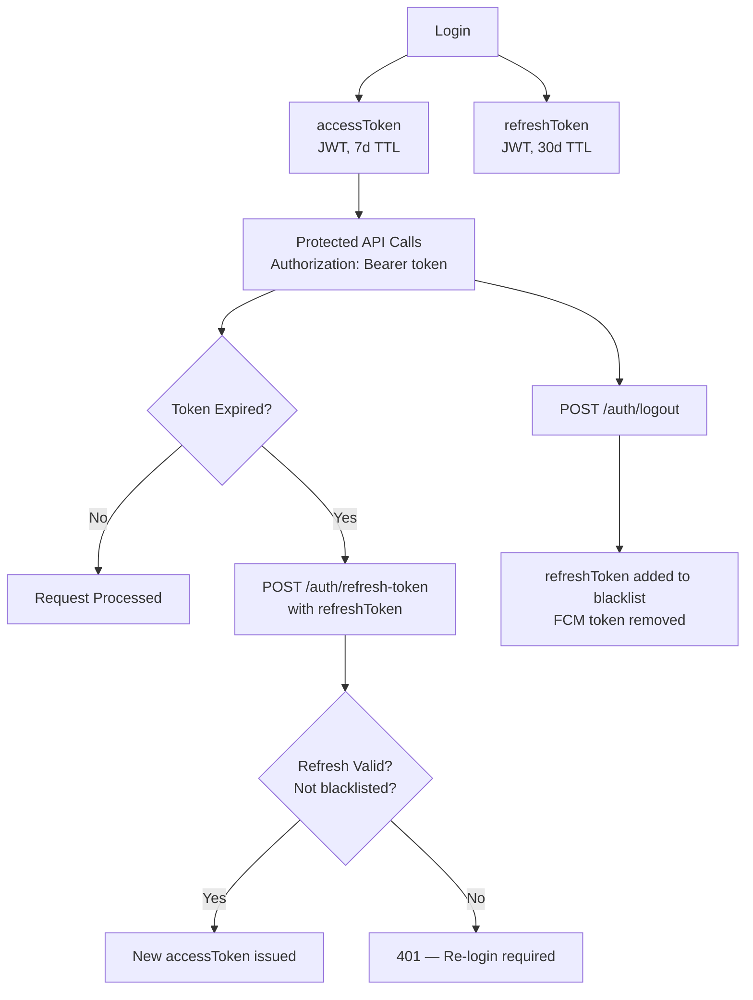

**Source:** `src/services/auth.service.js`, `src/models/RefreshTokenBlacklist.model.js`

---

## 4. Blood Request Lifecycle (Hospital Perspective)

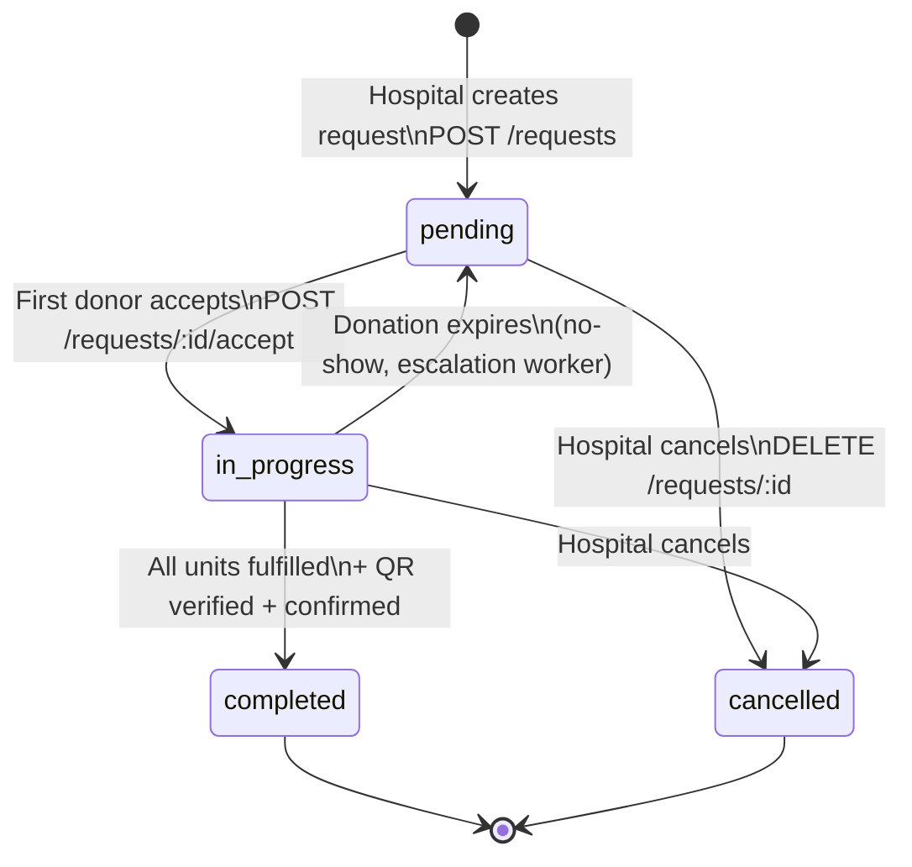

**Status definitions:**
- `pending`: Request is open; compatible donors are being notified
- `in-progress`: At least one donor has accepted; waiting for arrival/confirmation
- `completed`: All required units collected and verified
- `cancelled`: Closed by hospital or system

**Source:** `src/models/Request.model.js`, `src/constants/request.constants.js`

---

## 5. Donor Response to a Request

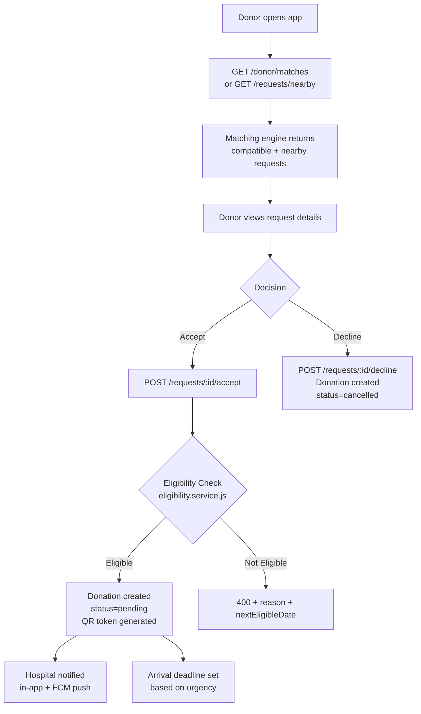

**Eligibility rules checked:**
1. Account not suspended or deleted
2. No chronic conditions (from `healthHistory`)
3. No active donation already in progress
4. Age ≥ 17 years
5. Not in temporary deferral window
6. Not deferred due to travel to malaria-risk country (within 28 days)
7. Donation cooldown satisfied (type-specific)
8. Hemoglobin ≥ 12.5 g/dL (if recorded)

**Source:** `src/services/eligibility.service.js`

---

## 6. Donation Verification Flow (QR Handoff)

This is the on-site hospital verification flow after a donor arrives:

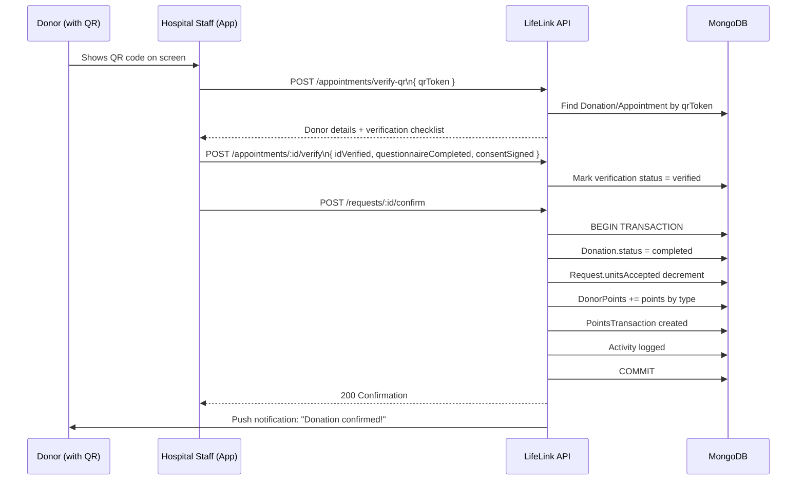

**Source:** `src/services/donation-completion.service.js`, `src/controllers/request.controller.js`, `src/controllers/appointment.controller.js`

---

## 7. Appointment Booking Flow (4-Step Wizard)

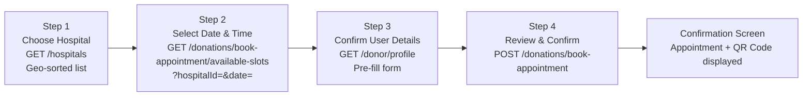

**Slot availability logic:**
- Hospital's `workingHoursStart` and `workingHoursEnd` define the day's range
- `slotsPerHour` determines the number of slots per hour
- Existing appointments on that date reduce available slots

**Source:** `src/services/appointment.service.js`, `src/models/Hospital.model.js`, `README.md`

---

## 8. Request Escalation — Background Workflow

This workflow runs without user interaction, driven by `requestEscalation.worker.js`:

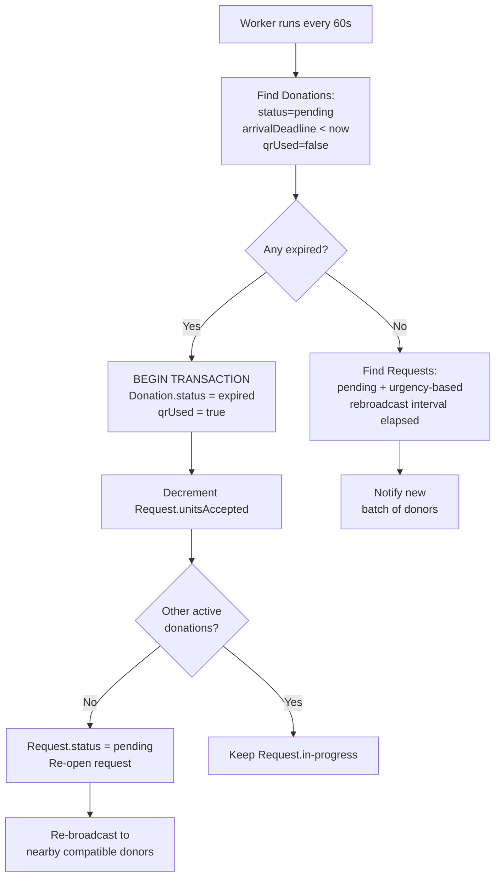

**Urgency-based timeouts** (from `src/constants/request-timeout.constants.js`):
- `critical`: acceptance deadline = 30 min, arrival deadline = 1 hr
- `high`: acceptance deadline = 2 hr, arrival deadline = 4 hr
- `medium`: acceptance deadline = 4 hr, arrival deadline = 8 hr
- `low`: acceptance deadline = 8 hr, arrival deadline = 24 hr

**Source:** `src/workers/requestEscalation.worker.js`, `src/constants/request-timeout.constants.js`

---

## 9. Rewards & Gamification Flow

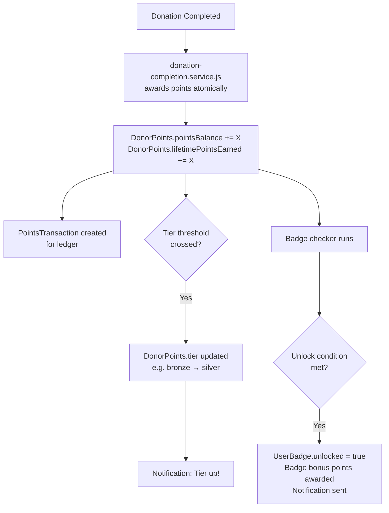

**Point values by donation type:**
- Blood: 200 pts
- Platelets: 175 pts
- Double red cells: 175 pts
- Plasma: 150 pts

**Source:** `src/services/reward.service.js` `POINTS_BY_TYPE` constant, `src/models/DonorPoints.model.js`

---

## 10. Password Reset Flow

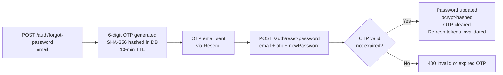

**Source:** `src/services/auth.service.js`

---

## 11. Maintenance Mode

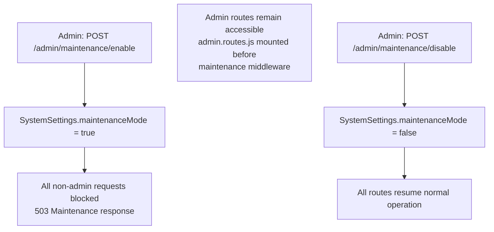

**Source:** `src/middlewares/maintenance.middleware.js`, `src/app.js` lines 134–138

---

## Confidence Report

**Verified Facts:**
- All state transitions come from enum definitions in `Request.model.js` and `Donation.model.js`.
- Eligibility rule sequence comes directly from `eligibility.service.js` `canDonate()` function.
- QR verification checklist fields (`idVerified`, `questionnaireCompleted`, `consentSigned`) come from `Appointment.model.js` and `Donation.model.js`.
- 4-step appointment flow is described in `README.md` and confirmed by `appointment.service.js`.
- Worker interval (60s) comes from `server.js` `startEscalationWorker` default.
- Point values come from `reward.service.js` `POINTS_BY_TYPE` object.
- Maintenance middleware order (admin before maintenance) comes from `app.js` lines 134–138.

**Assumptions:** None.

**Missing Information:**
- Flutter app screen implementations are not in this repository; UI flow descriptions come from `README.md`.
- Exact urgency timeout values require reading `src/constants/request-timeout.constants.js` which was listed but not read; the values cited in Section 8 come from `docs/PROJECT_STATUS.md`.

**Potential Uncertainty:**
- The exact notification content (message text) for each event type was not traced; it is generated in `notification.service.js`.
